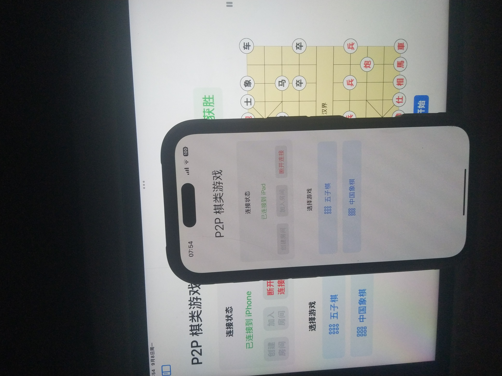
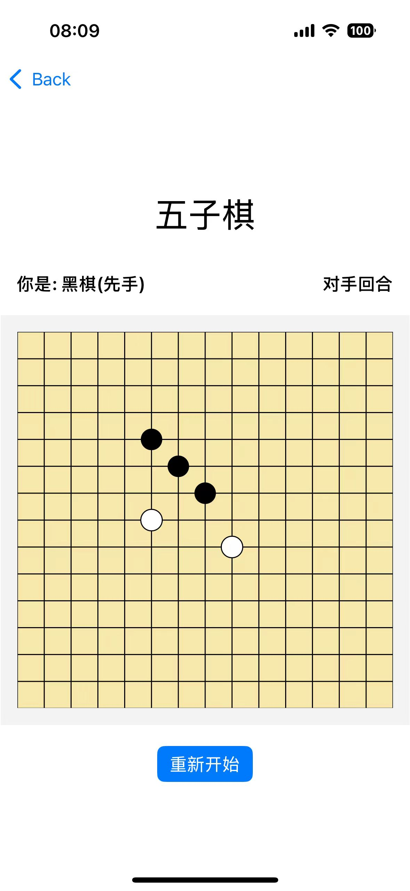
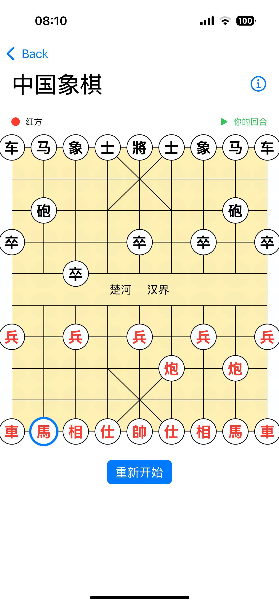
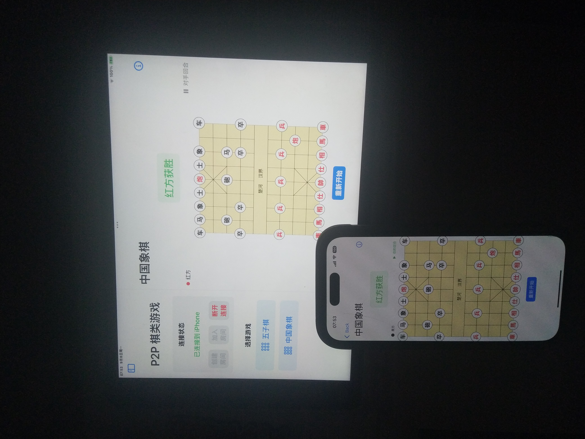

# P2P Board Games 🎮

一个基于点对点（P2P）连接的双人棋类游戏应用，支持五子棋和中国象棋。

## 功能特性 ✨

- **P2P 连接**：使用 MultipeerConnectivity 框架实现设备间直连，无需服务器
- **两款经典游戏**：
  - 🔵 **五子棋**：15x15 棋盘，先连成五子者胜
  - ♟️ **中国象棋**：完整实现所有棋子移动规则
- **实时同步**：棋步在设备间实时同步
- **智能界面**：
  - 胜利提示显示在顶部
  - Info 按钮可查看详细游戏状态
  - 清晰的回合指示

## 应用截图 📸

### 连接界面


### 五子棋游戏


### 中国象棋游戏


### 象棋对弈


## 系统要求 📱

- iOS 14.0+
- Xcode 12.0+
- 两台 iOS 设备（iPhone/iPad）
- 设备需在同一局域网或蓝牙范围内

## 安装步骤 🛠️

1. 克隆仓库：
```bash
git clone https://github.com/build-your-own-x-with-ai/P2PGame.git
cd P2PGame
```

2. 打开 Xcode 项目：
```bash
open P2P.xcodeproj
```

3. 配置签名：
   - 选择你的开发者账号
   - 修改 Bundle Identifier

4. 在两台设备上分别运行应用

## 使用说明 📖

### 建立连接

1. **设备 A**：点击"创建房间"
2. **设备 B**：点击"加入房间"
3. 等待连接建立（状态会显示"已连接"）

### 五子棋

- 黑棋先行
- 点击棋盘交叉点落子
- 先连成五子（横、竖、斜）者获胜
- 支持重新开始游戏

### 中国象棋

- 红方先行
- 点击选中棋子，再点击目标位置移动
- 遵循标准中国象棋规则：
  - **将/帅**：九宫格内移动，不可照面
  - **士/仕**：九宫格内斜线移动
  - **象/相**：田字移动，不可过河
  - **马**：日字移动，可被蹩马脚
  - **车**：直线移动
  - **炮**：直线移动，隔子吃子
  - **兵/卒**：过河前只能前进，过河后可左右移动

### 界面功能

- **Info 按钮**：点击显示/隐藏详细游戏信息
- **状态栏**：显示当前玩家和回合信息
- **胜利提示**：游戏结束时顶部显示获胜方

## 项目结构 📁

```
P2P/
├── P2P/
│   ├── P2PApp.swift              # 应用入口
│   ├── ContentView.swift          # 主菜单界面
│   ├── P2PManager.swift           # P2P 连接管理
│   ├── SimpleFiveInRowView.swift  # 五子棋游戏界面
│   ├── SimpleChineseChessView.swift # 中国象棋游戏界面
│   └── Info.plist                 # 应用配置（网络权限）
└── README.md
```

## 技术实现 🔧

- **框架**：SwiftUI + MultipeerConnectivity
- **通信协议**：使用 Codable 协议序列化游戏数据
- **状态管理**：ObservableObject + @Published 属性
- **绘图**：Canvas API 绘制棋盘和棋子

## 网络权限配置

应用需要本地网络权限，已在 Info.plist 中配置：
- `NSLocalNetworkUsageDescription`：说明使用本地网络的原因
- `NSBonjourServices`：声明 Bonjour 服务类型

## 故障排除 🔍

1. **无法发现设备**：
   - 确保两台设备在同一 Wi-Fi 网络
   - 检查设备的网络权限设置
   - 重启应用重试

2. **连接中断**：
   - 检查网络稳定性
   - 确保应用保持前台运行

3. **棋子无法移动**：
   - 确认是否轮到你的回合
   - 检查移动是否符合规则

## 贡献指南 🤝

欢迎提交 Issue 和 Pull Request！

## 许可证 📄

MIT License

---

*Enjoy playing! 🎮*
